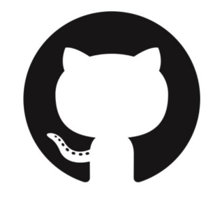
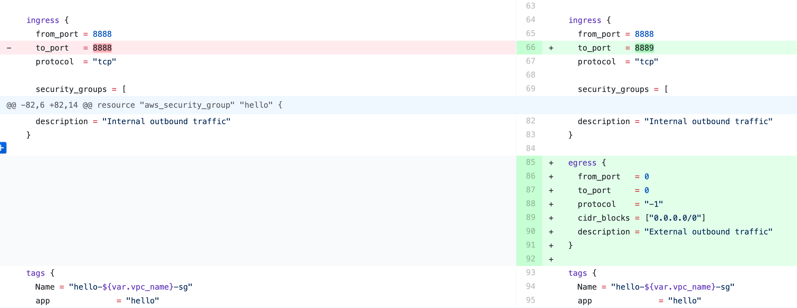
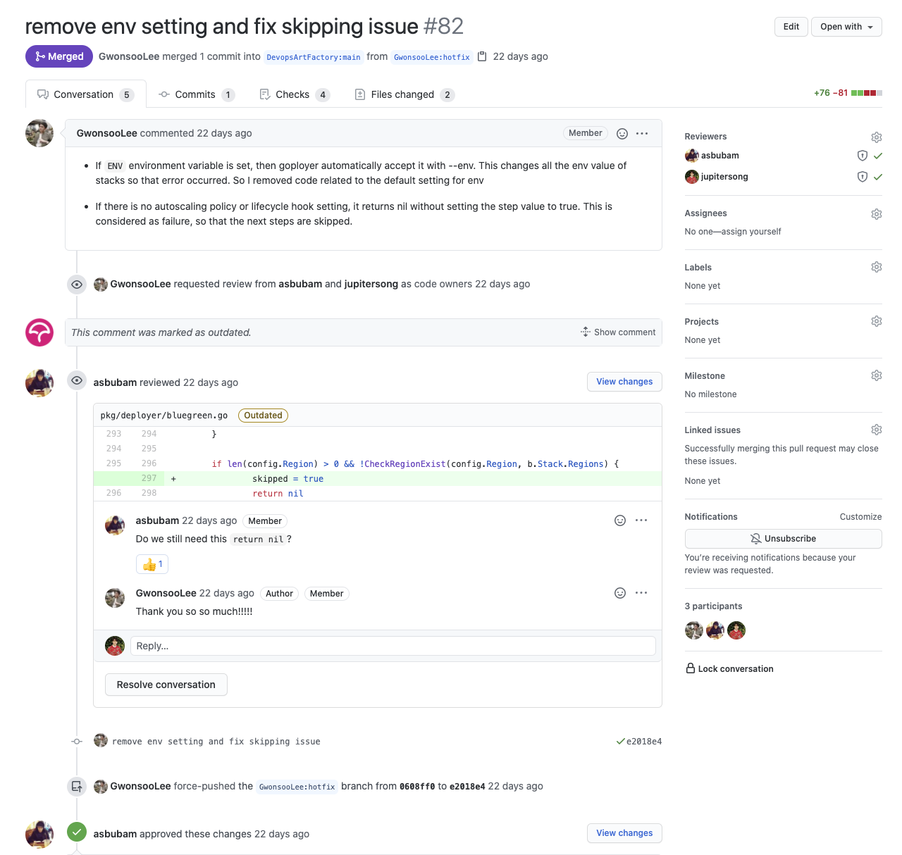
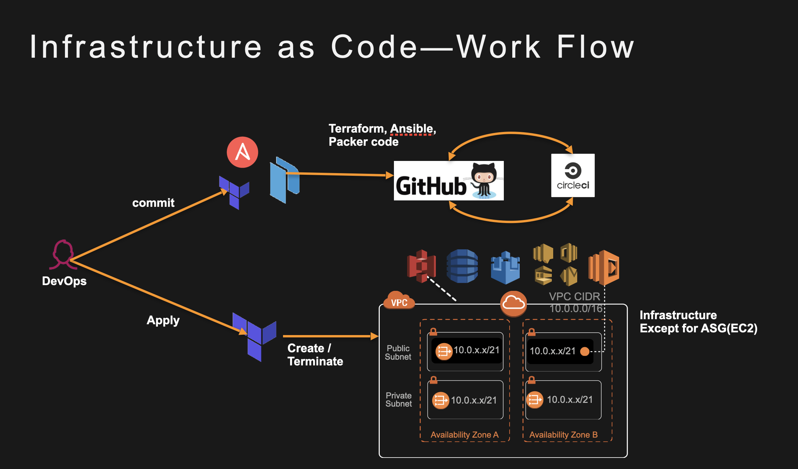

#### Terraform with Github
IaC는 Infrastructure as Code 코드로써의 인프라를 이야기합니다.
Terraform 은 IaC 도구이며, 즉 테라폼은 코드를 수행합니다.
그렇기 때문에 반드시 코드로써의 관리가 필요하며, 팀원간의 코드리뷰가 필요합니다.
코드리뷰란 팀원들끼리 서로의 코드를 점검하고, 서로의 코드를 배우는 것입니다.

* github 를 모르는 사람은 없겠죠?

* 코드리뷰 예제입니다. 보통 Pull Request 를 이용하여 팀원들끼리 리뷰를 진행합니다. 코드리뷰를 통해 변경사항을 정확히 파악해야 합니다.
코드의 변경사항을 파악하고 추적하는건 정말 중요합니다. 어느 시간대에 무슨 변경이 이루어졌는지를 알아야 합니다.

* 코드리뷰를 통해 서로 궁금한건 언제든 질문하고, 서로 배우는 문화가 되어야합니다. 

#### 코드리뷰 프로세스 with Github

