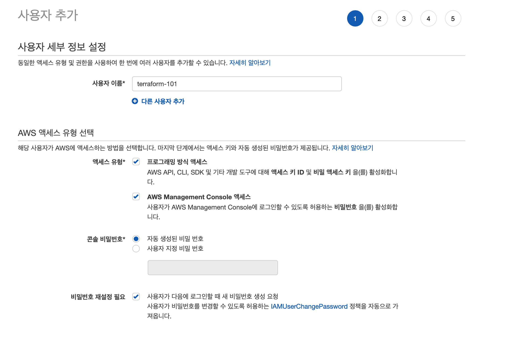
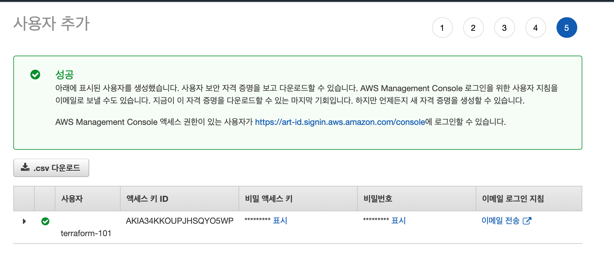

## AWS Configure 세팅하기

```bash
AWS Credentials 세팅을 완료하신 분들은 본 장을 스킵하셔도 됩니다.
```

AWS의 모든 리소스는 API를 통해서 생성할 수 있습니다. API란 응용프로그램에서 사용할 수 있도록 만들어놓은 하나의 인터페이스를 의미합니다. 즉, 정해진 인터페이스에 맞게 요청을 보내면 요청 받는 쪽에서 해당 요청대로 명령을 수행해준다고 생각하시면 됩니다.

AWS는 명령줄 인터페이스(CLI), SDK(소프트웨어 개발 킷), CDK(클라우드 개발 킷) 등 다양한 방식으로 API를 제공합니다. 이중에서 테라폼은 사실 SDK를 사용한다고 할 수 있는데, Terraform에서 내부적으로 요청을 하기 떄문입니다. AWS는 누구나 사용할 수 있는 클라우드 서비스 제공사이기 때문에, AWS 입장에서는 사용자를 구분해야할 필요가 있습니다. 이 때 사용하는 것이 바로 AWS_ACCESS_KEY_ID와 AWS_SECRET_ACCESS_KEY입니다. 조금 더 보태자면 위의 두 키 값은 해당 사용자의 권한도 포함하고 있습니다.

Terraform은 사용자가 지정해준 AWS_ACCESS_KEY_ID와 AWS_SECRET_ACCESS_KEY를 그대로 가져와서 사용하기 때문에, 테라폼을 사용하기 전에 반드시 세팅해주셔야 합니다.

그러면 지금부터 세팅을 해보도록 하겠습니다.

### IAM 사용자 생성

기존에 만들어 놓으신 AWS 계정에서 Root ID로 들어가신 후세 새로운 사용자를 생성합니다.

- Services(서비스)에서 `IAM` 을 검색
- `사용자` → `사용자 추가` 클릭
- 아래와 같이 작성합니다.
    - 사용자 이름 : 자유롭게 작성
    - 액세스 유형 : 프로그래밍 방식, AWS Management Console 액세스
    - 콘솔 비밀번호: 자유롭게 설정



- `다음:권한`  클릭
- `기존 정책 직접 연결` → `AdministratorAccess` 체크
- `다음:태그`  클릭
- `다음:검토`  클릭
- `사용자 만들기` 클릭
- 아래 계정 정보를 .csv 다운로드하시고 안전한 곳에 보관하시기 바랍니다.



### AWS Configure 세팅

```bash
AWS가 깔려있지 않으신 아래 링크를 참조해 주세요
https://docs.aws.amazon.com/ko_kr/cli/latest/userguide/cli-chap-install.html
```

```bash
$ aws configure
AWS Access Key ID [None]: <액세스 키 ID>
AWS Secret Access Key [None]: <비밀 액세스 키>
Default region name [ap-northeast-2]: ap-northeast-2
Default output format [json]:
```

세팅이 완료된 경우에는 `cat ~/.aws/credentials` 의 Default쪽에 설정되어 있는지 확인합니다.

```bash
$ cat ~/.aws/credentials
[default]
aws_access_key_id = ABCDEFXXXXXXX
aws_secret_access_key = KSdifi...
```

현재 설정된 사용자가 누구인지 확인하려면 아래의 명령어를 통해 확인하실 수 있습니다.

```bash
$ aws sts get-caller-identity
{
  "UserId": "XXXXX",
  "Account": "1234567891011",
  "Arn": "arn:aws:iam::123456781011:user/terraform-101"
}
```
