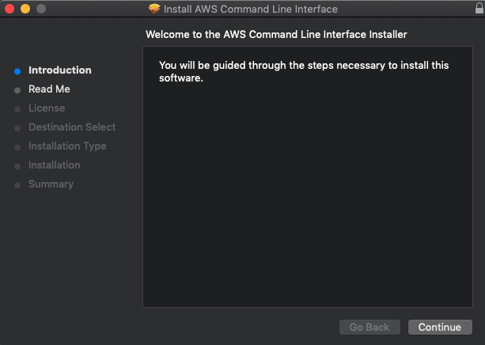

## AWS CLI 설치

현재 AWS CLI는 version 1, 2 가 있는데, 2에 훨씬 더 많은 기능이 있기 때문에 버전 2로  설치하는 것을 권장드립니다.


### MacOS

- [https://docs.aws.amazon.com/ko_kr/cli/latest/userguide/install-cliv2-mac.html](https://docs.aws.amazon.com/ko_kr/cli/latest/userguide/install-cliv2-mac.html)
1. macOS pkg 파일을 다운로드 합니다. 
    - [https://awscli.amazonaws.com/AWSCLIV2.pkg](https://awscli.amazonaws.com/AWSCLIV2.pkg)
2. 다운로드한 파일을 두 번 클릭하여 설치 관리자를 시작합니다.



3. 설정 및 버전을 확인합니다

```bash
$ which aws
/usr/local/bin/aws

$ aws --version
aws-cli/2.0.34 ...
```

### Linux

- [https://docs.aws.amazon.com/ko_kr/cli/latest/userguide/install-cliv2-linux.html#cliv2-linux-install](https://docs.aws.amazon.com/ko_kr/cli/latest/userguide/install-cliv2-linux.html#cliv2-linux-install)

```bash
# Linux x86 (64-bit)
curl "https://awscli.amazonaws.com/awscli-exe-linux-x86_64.zip" -o "awscliv2.zip"
unzip awscliv2.zip
sudo ./aws/install

# Linux ARM
curl "https://awscli.amazonaws.com/awscli-exe-linux-aarch64.zip" -o "awscliv2.zip"
unzip awscliv2.zip
sudo ./aws/install
```

### Windows

- [https://docs.aws.amazon.com/ko_kr/cli/latest/userguide/install-cliv2-windows.html](https://docs.aws.amazon.com/ko_kr/cli/latest/userguide/install-cliv2-windows.html)

1. Windows용 AWS CLI MSI 설치 관리자를 다운로드합니다.
    - [https://awscli.amazonaws.com/AWSCLIV2.msi](https://awscli.amazonaws.com/AWSCLIV2.msi)
2. 기본적으로 AWS CLI는 C:\Program Files\Amazon\AWSCLIV2에 설치됩니다.
3. 버전을 확인합니다.

```bash
C:\> aws --version
aws-cli/2.0.23 Python/3.7.4 Windows/10 botocore/2.0.0
```

## Terraform 설치

- 테라폼은 Infrastructure as Code를 구현할 수 있는 대표적인 오픈소스 툴입니다.
- 최신 테라폼 버전을 다운로드 받으시는 것을 권장드립니다.

### URL로 특정 버전 설치

- 최신 버전 테라폼 : [https://www.terraform.io/downloads.html](https://www.terraform.io/downloads.html)
- 이전 버전 테라폼 : [https://releases.hashicorp.com/terraform/](https://releases.hashicorp.com/terraform/)
    - Mac 유저는 darwin_amd64.zip 가 붙은 파일을 다운로드 하시면 됩니다.
- 설치한 Binary 파일을 `/usr/local/bin` 으로 옮기면 terraform 명령어를 사용하실 수 있습니다.

```bash
$ curl -sO https://releases.hashicorp.com/terraform/0.12.24/terraform_0.12.24_darwin_amd64.zip
$ unzip terraform_0.12.24_darwin_amd64.zip
$ mv terraform /usr/local/bin
$ terraform --version
Terraform v0.12.24
```

### 

### Homebrew 로 설치

- Homebrew를 사용하면 손쉽게 최신 버전을 다운 받으실 수 있습니다.

```bash
$ brew install terraform
$ terraform --version
Terraform v0.12.24

```

### 여러 버전 동시에 사용하는 경우

- 서로 다른 테라폼 버전을 사용하시는 경우에는 alias를 통해서 구분하시면 편하게 사용하실 수 있습니다.

```bash
# ~/.zshrc or ~/.bashrc
alias tf12="/usr/local/bin/terraform"
alias tf11="/usr/local/bin/terraform11”
```
