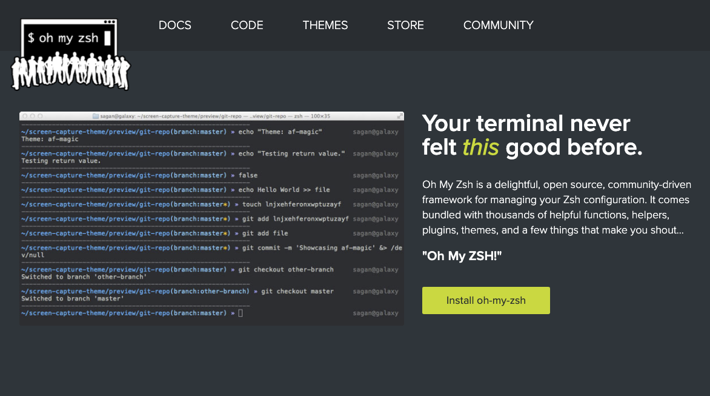

## zsh 설치

zsh 은 Z shell 의 약자로써, shell 의 확장버전이라고 볼 수 있습니다.
다양한 테마를 제공하고 shell 의 확장기능을 제공함으로써 사용성을 높힐 수 있습니다.

ex. Auto completion, Correction, plugin


#### MacOS 설치 ( homebrew )

```bash
$ brew install zsh
```

#### Linux 설치 ( Amazon Linux )
ubuntu 는 apt-get 을 사용하시면 됩니다.
```bash
[ec2-user@ip-10-101-84-40 ~]$ sudo yum install zsh
Loaded plugins: dkms-build-requires, extras_suggestions, langpacks, priorities, update-motd
amzn2-core                                                                                                                | 3.7 kB  00:00:00
amzn2extra-BCC                                                                                                            | 1.7 kB  00:00:00
amzn2extra-docker                                                                                                         | 3.0 kB  00:00:00
amzn2extra-redis4.0                                                                                                       | 1.8 kB  00:00:00
newrelic-infra/signature                                                                                                  |  836 B  00:00:00
newrelic-infra/signature                                                                                                  | 2.5 kB  00:00:00 !!!
Resolving Dependencies
--> Running transaction check
---> Package zsh.x86_64 0:5.7.1-6.amzn2.0.1 will be installed
--> Finished Dependency Resolution

Dependencies Resolved

=================================================================================================================================================
 Package                     Arch                           Version                                     Repository                          Size
=================================================================================================================================================
Installing:
 zsh                         x86_64                         5.7.1-6.amzn2.0.1                           amzn2-core                         2.9 M

Transaction Summary
=================================================================================================================================================
Install  1 Package

Total download size: 2.9 M
Installed size: 7.1 M
Is this ok [y/d/N]: y
Downloading packages:
zsh-5.7.1-6.amzn2.0.1.x86_64.rpm                                                                                          | 2.9 MB  00:00:00
Running transaction check
Running transaction test
Transaction test succeeded
Running transaction
  Installing : zsh-5.7.1-6.amzn2.0.1.x86_64                                                                                                  1/1
  Verifying  : zsh-5.7.1-6.amzn2.0.1.x86_64                                                                                                  1/1

Installed:
  zsh.x86_64 0:5.7.1-6.amzn2.0.1

Complete!
```

## oh my zsh 설치 - Linux 및 MacOS 환경 설치 동일

- [ohmyzsh](https://github.com/ohmyzsh/ohmyzsh) 은 zsh 설정을 관리해주는 오픈소스 프레임워크입니다.
Terminal 환경을 보다 예쁘고 효율적으로 만들어주는 역할을 합니다.



```bash
[ec2-user@ip-10-101-84-40 ~]$ chsh -s /bin/zsh # 기본쉘은 zsh 로 변경 몇몇 os는 util-linux-user.x86_64 를 설치해주어야 합니다.
Changing shell for ec2-user.
Password:
Shell changed.
[ec2-user@ip-10-101-84-40 ~]$ curl -L https://raw.github.com/robbyrussell/oh-my-zsh/master/tools/install.sh | sh
  % Total    % Received % Xferd  Average Speed   Time    Time     Time  Current
                                 Dload  Upload   Total   Spent    Left  Speed
  0     0    0     0    0     0      0      0 --:--:-- --:--:-- --:--:--     0
100  8545  100  8545    0     0   6924      0  0:00:01  0:00:01 --:--:--  6924
Cloning Oh My Zsh...
Cloning into '/home/ec2-user/.oh-my-zsh'...
remote: Enumerating objects: 1155, done.
remote: Counting objects: 100% (1155/1155), done.
remote: Compressing objects: 100% (1121/1121), done.
remote: Total 1155 (delta 20), reused 1082 (delta 18), pack-reused 0
Receiving objects: 100% (1155/1155), 775.56 KiB | 989.00 KiB/s, done.
Resolving deltas: 100% (20/20), done.

Looking for an existing zsh config...
Using the Oh My Zsh template file and adding it to ~/.zshrc.

         __                                     __
  ____  / /_     ____ ___  __  __   ____  _____/ /_
 / __ \/ __ \   / __ `__ \/ / / /  /_  / / ___/ __ \
/ /_/ / / / /  / / / / / / /_/ /    / /_(__  ) / / /
\____/_/ /_/  /_/ /_/ /_/\__, /    /___/____/_/ /_/
                        /____/                       ....is now installed!


Before you scream Oh My Zsh! please look over the ~/.zshrc file to select plugins, themes, and options.

• Follow us on Twitter: https://twitter.com/ohmyzsh
• Join our Discord server: https://discord.gg/ohmyzsh
• Get stickers, shirts, coffee mugs and other swag: https://shop.planetargon.com/collections/oh-my-zsh

Run zsh to try it out
```
oh my zsh 의 테마 는 개인 선호도에 따라 선택하면 되지만, 
적절한 컬러, Git branch, commit 확인이 되는 테마를 고르는게 좋습니다. 저는 ys 를 선호합니다.

```bash
[ec2-user@ip-10-101-84-40 ~] sudo vim ~/.zshrc
# in ~/.zshrc
ZSH_THEME="ys" ## THEME 변경 후 터미널 재실행
# ec2-user @ ip-172-31-8-195 in ~ [19:43:14] 
$ 
# 터미널 재실행
# ec2-user @ ip-10-101-84-40 in ~ [19:12:42]
$
```
